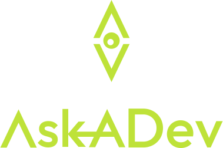

# 

## Welcome to Askadev.dev

Welcome to Askadev.dev, a platform designed to connect developers, collaborate on solving problems! Join Askadev to share knowledge, tackle challenges, and build solutions together!

## Visit askadev!
[Visit Askadev.dev](https://www.askadev.dev)

## Getting Started ON Developing AskaDEV!

1. **Clone the Repository:**

   ```bash
   git clone https://github.com/Jsonbourne-dev/Askadev.dev.git
   ```

2. **Install Dependencies:**

   ```bash
   npm install
   ```

3. **Start the Application:**

   ```bash
   npm start
   ```

4. **To open the Cypress test runner, use the following command:**

   ```bash
   yarn cypress open
   ```

## Collaborators

<table>
  <tr>
    <td align="center">
      <a href="https://github.com/duncannevin">
        
        <br />
        <sub><b>Duncan Nevin</b></sub>
      </a>
    </td>
    <td align="center">
      <a href="https://github.com/jsonbourne-dev">
        
        <br />
        <sub><b>jsonbourne-dev</b></sub>
      </a>
    </td>
  </tr>
</table>
